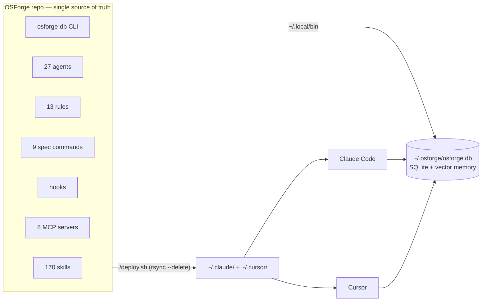
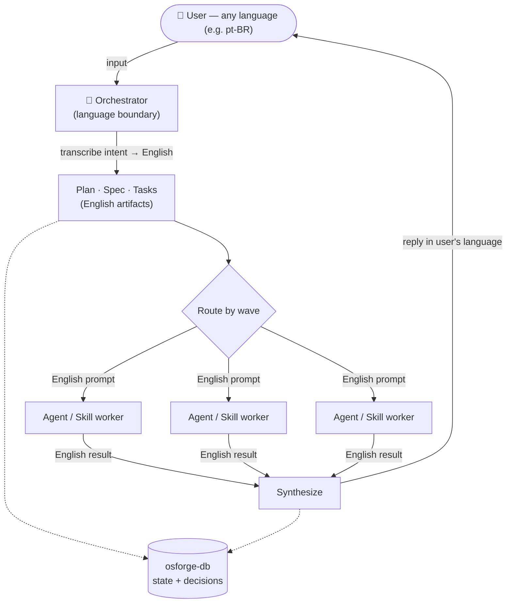
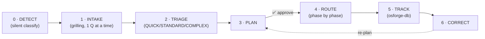
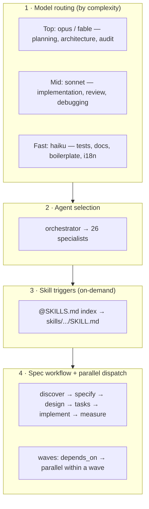
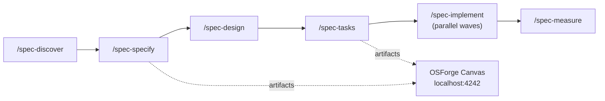

# 🔨 OSForge

**An AI-powered development framework: skills, agents, rules, hooks, commands, and a full library of specialists — the single source of truth for your global Claude Code (`~/.claude/`) and Cursor (`~/.cursor/`) configuration.**

170 on-demand skills · 27 specialized agents · 13 always-on rules · 9 spec commands · zero-token Python hooks · local SQLite state with a cross-project task board · 121 business specialists · local generative UI. Tuned for **Next.js + TypeScript + Prisma + Supabase + Bun**, with coverage for mobile, game dev, Rust, Python, and more.

> *"Forging the development environment for AI-powered teams."*

📖 **[Usage guide → USAGE.md](USAGE.md)** · 💡 **[Examples → docs/EXAMPLES.md](docs/EXAMPLES.md)** · 🧭 **[Skill standard → docs/SKILL-STANDARD.md](docs/SKILL-STANDARD.md)** · 🗺️ **[Decisions → docs/DECISIONS.md](docs/DECISIONS.md)**

---

## Table of contents

- [Why OSForge](#why-osforge)
- [Architecture](#architecture)
  - [Source of truth → deploy → runtimes](#1-source-of-truth--deploy--runtimes)
  - [Orchestration & the language boundary](#2-orchestration--the-language-boundary)
  - [The four routing layers](#3-the-four-routing-layers)
  - [Spec-driven workflow](#4-spec-driven-workflow)
- [Quick start](#quick-start)
- [What's inside](#whats-inside)
- [Language & authoring standard (ADR-011)](#language--authoring-standard-adr-011)
- [Stack compatibility](#stack-compatibility)
- [Origins](#origins)
- [License](#license)

---

## Why OSForge

AI coding agents are only as good as the context they receive. OSForge solves five problems:

1. **Context efficiency** — 170 skills in a ~12K-token base (~6% of a 200K window). Everything else loads on demand.
2. **Stack-specific patterns** — skills tuned for Next.js App Router + Prisma + Supabase + shadcn/ui, with broad coverage for mobile, game dev, Rust, Python, and cross-platform.
3. **Built-in quality gates** — TDD enforcement, security auditing, red-team tactics, insecure-defaults detection, a Reality Check + Quality Control loop in every agent, and zero-token Python hooks.
4. **Local SQLite state** — `osforge-db` persists project state, decisions, blockers, and a task board (waves, dependencies, priorities) with a cross-project view. Session resume in ~50 tokens.
5. **Generative UI** — OSForge Canvas renders every spec and plan as an interactive browser artifact (cards, tables, dependency graphs, checklists, approve/edit/reject). No external APIs.

---

## Architecture

OSForge is **not an application** — it is a curated configuration that turns a stock AI coding agent into an orchestrated, stateful, quality-gated system. Four ideas hold it together: a **single source of truth** that deploys to your runtimes, an **orchestrator** that plans and delegates, a **language boundary** that keeps the internals English while you work in your own language, and a **local state layer** that remembers across sessions.

### 1. Source of truth → deploy → runtimes

The repo is authoritative. Nothing is edited in `~/.claude/` directly (ADR-001); changes are committed here and pushed out by `./deploy.sh`.



### 2. Orchestration & the language boundary

The **orchestrator** is an always-active meta-agent and the system's single **translation boundary** (ADR-011): it understands your input in any language, transcribes intent to English, coordinates the entire internal pipeline in English, and replies to you in your language.



> **Rule of thumb:** if a worker, skill, file, or artifact reads it, it's English. If the user reads it, it's the user's language.

The orchestrator's own flow is a checkpointed state machine — nothing advances without explicit approval:



### 3. The four routing layers

Every demand is resolved through four decisions — never skip triage.



### 4. Spec-driven workflow

Non-trivial features run the `spec-*` cycle; `tasks.md` carries `wave` + `depends_on`, so independent work dispatches in parallel and the `osforge-db` board tracks the waves.



---

## Quick start

```bash
git clone https://github.com/plocemourasouza/osforge.git
cd osforge
./deploy.sh
```

`deploy.sh` syncs everything to `~/.claude/` and `~/.cursor/` automatically (use `--dry-run` to preview, `--claude-only`/`--cursor-only` to scope, `--with-qdrant` to provision vector memory). See [USAGE.md](USAGE.md) for manual and advanced options.

**Next steps:**
- **Usage and workflows** → [USAGE.md](USAGE.md)
- **Skill index (170 skills + triggers)** → [claude-code/SKILLS.md](claude-code/SKILLS.md)
- **Session orchestration** → [claude-code/CLAUDE.md](claude-code/CLAUDE.md)
- **Authoring a new skill** → [docs/SKILL-STANDARD.md](docs/SKILL-STANDARD.md) + [docs/SKILL.template.md](docs/SKILL.template.md)

---

## What's inside

### 170 on-demand skills

Full index with triggers in [claude-code/SKILLS.md](claude-code/SKILLS.md). Main categories:

- **Core & Workflow** — TDD, Verification Before Completion, Security Best Practices, Coding Guidelines (Karpathy Rules), Git, Clean Code, Spec/PRD/Architecture builders, Epic Decomposer, Story Executor.
- **Frontend & UI** — React + Next.js Expert (9 modules), shadcn/ui, Tailwind v4, Frontend Design, Aesthetic Boost, Design Taste Dials, Aesthetic Modes (Editorial Minimalist / Industrial Brutalist / Soft Premium), Redesign Audit, UI Design Intelligence, Core Web Vitals, Accessibility (WCAG), i18n, SEO/GEO.
- **Backend & Database** — Prisma Expert, PostgreSQL + Supabase, Auth (SSR), Stripe, API Patterns (REST/GraphQL/tRPC), Database Design, Node.js, Bun, Server Management.
- **Security** — Red Team Tactics (MITRE ATT&CK), Vulnerability Scanner (OWASP), Insecure Defaults Detection, GDPR/LGPD, plus offensive-security skills (authorized testing only).
- **Testing & Quality** — E2E Playwright, Testing Patterns, Adversarial Review, Code Review, Edge Case Hunter, UI Audit, Readiness Gate, Output Enforcement.
- **Meta & Context** — Systematic Debugging, Performance Profiling, Smart Model Dispatch, llmfit Advisor, Context Distillator, osforge-db, OSForge Canvas, Stuck Recovery, Config Critique, Context Compact, Tool Safety Classifier, Evolve/Instinct.
- **The Agency** — 121 AI specialists across 10 divisions + 32 marketing execution workflows.

### 27 specialized agents

Every agent ships a Reality Check (anti-self-deception) and a Quality Control loop (mandatory verification). Full roster in [USAGE.md](USAGE.md).

- **Orchestrator** — meta-agent: intake, triage, planning, routing to 26 specialists, cross-session tracking, and the language boundary.
- **Engineering** — frontend-engineer, backend-engineer, database-architect, mobile-developer, game-developer, devops-engineer, performance-optimizer.
- **Quality & Security** — code-reviewer, code-refactorer, security-auditor, penetration-tester, test-engineer, qa-automation-engineer, validator.
- **Planning & Product** — planner, system-architect, project-planner, product-manager, product-owner, product-strategy-advisor.
- **Investigation** — debugger, explorer-agent, code-archaeologist.
- **Docs & SEO** — documentation-writer, seo-specialist, git-commit-helper.

### 13 always-on rules (Cursor)

TypeScript Strict, Code Style, Product Thinking (PDD), TDD Enforcement, Next.js Patterns, Security Mindset, Intelligent Routing, Anti-AI-Slop, Commit Conventions, Agent Skills Reference, Memory Hierarchy, Artifact Chain, Orchestrator Awareness. (Claude Code equivalents live inside `claude-code/CLAUDE.md`.)

### 9 spec commands (`/spec-*`)

`/spec-discover` · `/spec-specify` · `/spec-design` · `/spec-tasks` · `/spec-implement` · `/spec-clarify` · `/spec-checklist` · `/spec-constitution` · `/spec-measure`

### Hooks (zero token cost)

Run by the runtime — they consume no context tokens:

- **GateGuard** (`gateguard.py`, PreToolUse Bash) — blocks only the irreversible/shared (`rm -rf`, `git push --force`, `reset --hard`, `clean -f`, SQL `DROP/TRUNCATE/DELETE`); kill-switch `OSFORGE_GATEGUARD=off`.
- **scan-secrets** (`scan-secrets.sh`) — blocks secrets before they reach a commit.
- **protect-tests** (`protect-tests.sh`) — warns when a test file is altered.
- **observe → evolve** (`observe-capture.py`) — records session observations for `osforge-db evolve`.
- **Auto-resume** (`session-resume.sh` / `session-save.py`) — SessionStart injects `osforge-db resume`; Stop writes `set-resume` automatically.
- **Canvas autostart** (`canvas-autostart.sh`) — boots the Canvas server (port 4242) when needed.

### osforge-db — local SQLite state + memory

A Python CLI over a local SQLite database (`~/.osforge/osforge.db`). No server, no network. Persists projects, phases, tasks (`wave`/`depends_on`), decisions with FTS5 full-text search, and blockers. Session resume in ~50 tokens via `osforge-db resume <slug>`; cross-project view via `osforge-db board`. Optional 3-tier vector memory (Qdrant → SQLite cosine → FTS5) for semantic recall.

### OSForge Canvas — local generative UI

A local Bun service at `localhost:4242`. The agent writes versioned JSON artifacts; the browser renders cards, tables, dependency graphs, gantt, checklists, and decision buttons with SSE live-reload. Feedback returns as structured JSON. Default for every spec and plan — opt out with "text only".

---

## Language & authoring standard (ADR-011)

OSForge separates **authoring language** from **runtime language**:

- **Authoring = English.** All repository content (skills, agents, rules, `CLAUDE.md`, `SKILLS.md`, commands, ADRs, comments) is written in English — one language maximizes the model's predictability and removes mixed-language drift.
- **Runtime = the user's language**, via the orchestrator translation boundary (see [Architecture §2](#2-orchestration--the-language-boundary)).

New skills follow a single standard — [`docs/SKILL-STANDARD.md`](docs/SKILL-STANDARD.md) — built from [`docs/SKILL.template.md`](docs/SKILL.template.md). It merges OSForge's activation pattern (`Use when` / `Keywords` / `Do NOT use for`) and execution-routing frontmatter (`model` / `context` / `agent` / `allowed-tools`) with an explicit invocation axis (orchestrator vs. discipline), leading words, checkable completion criteria, and a failure-mode audit. Activation is validated with `scripts/test-skill-triggering.sh`.

### Bundled subsystems

- **Design Taste System** — adapted from [Leonxlnx/taste-skill](https://github.com/Leonxlnx/taste-skill) (MIT): three adjustable dials (DESIGN_VARIANCE / MOTION_INTENSITY / VISUAL_DENSITY), three per-project aesthetic modes, anti-AI-slop rules, GSAP scrollytelling, Bento 2.0, double-bezel cards, micro-physics.
- **Agentic AI patterns** — adapted from [Leonxlnx/agentic-ai-prompt-research](https://github.com/Leonxlnx/agentic-ai-prompt-research): `tool-safety-classifier`, `context-compact`, `config-critique`, `stuck-recovery`, `memory-hierarchy`, the Coordinator Protocol in the orchestrator, and a documented prompt-cache boundary.
- **UI Design Intelligence** — adapted from [nextlevelbuilder/ui-ux-pro-max](https://github.com/nextlevelbuilder/ui-ux-pro-max-skill) (MIT): 161 industry reasoning rules, 161 palettes, 84 styles, 73 typographic pairs.
- **The Agency** — 121 business specialists in 10 divisions + 32 marketing execution workflows. Architecture: Agent (persona — *who I am*) + Workflow (execution — *what I do*); 4 agents require mandatory human approval before any autonomous action.
- **llmfit Advisor** — detects your hardware and recommends which local LLMs fit (quantization, speed, fit scoring across 497 models). Source: [AlexsJones/llmfit](https://github.com/AlexsJones/llmfit) (MIT).

---

## Stack compatibility

| Layer | Technology |
|---|---|
| Framework | Next.js 15+ (App Router) |
| Language | TypeScript (strict mode) |
| ORM | Prisma |
| Database | PostgreSQL via Supabase |
| Auth | Supabase Auth (SSR) |
| UI | shadcn/ui + Tailwind CSS |
| Runtime | Bun |
| Deployment | Vercel |
| Payments | Stripe |
| Testing | Playwright + Bun test |
| AI tools | Claude Code, Cursor |

**MCP servers** — 8 configured (Context7, GitHub, Supabase, Shadcn, Browsermcp, next-devtools, Prisma-Local, Prisma-Remote). See `mcp/claude-code.json`.

---

## Origins

OSForge is a **curation**, not a fork. It distills **1100+ agent skills, commands, and patterns from 23 sources** into one coherent, English-authored, stack-tuned framework. Nothing is copied wholesale — every upstream is adapted to the OSForge standard, credited with `inspired_by`/`source` frontmatter, and the raw collections live disk-only under `sources/` (ADR-009). What each source contributed:

### Foundations & format

| Source | Contribution |
|---|---|
| [Anthropic](https://github.com/anthropics) | Skill format, core skills, brand guidelines |
| [GitHub spec-kit](https://github.com/github/spec-kit) · OpenSpec | Spec-driven workflow + the `constitution` pattern |
| BMAD-METHOD · GSD | Multi-phase planning and discovery discipline |
| superpowers · context-engineering | Context budgeting, progressive disclosure, prompt-cache strategy |

### Engineering, security & platform

| Source | Contribution |
|---|---|
| [Vercel Labs](https://github.com/vercel) | Next.js + React performance patterns |
| [Trail of Bits](https://github.com/trailofbits) | Security-audit methodology, threat modeling |
| [Supabase](https://github.com/supabase) · Prisma | Postgres, RLS, auth (SSR), ORM patterns |
| [Expo](https://github.com/expo) | Mobile / React Native coverage |
| [Cloudflare](https://github.com/cloudflare) · [Sentry](https://github.com/getsentry) | Edge/deploy and observability patterns |
| claude-red | Offensive-security tactics (authorized testing only) |

### Design, agentic patterns & business

| Source | Contribution |
|---|---|
| [Leonxlnx/taste-skill](https://github.com/Leonxlnx/taste-skill) (MIT) | Premium frontend taste system — dials, aesthetic modes, anti-AI-slop |
| [Leonxlnx/agentic-ai-prompt-research](https://github.com/Leonxlnx/agentic-ai-prompt-research) | Coordinator Protocol, tool-safety, context-compact, stuck-recovery |
| [nextlevelbuilder/ui-ux-pro-max](https://github.com/nextlevelbuilder/ui-ux-pro-max-skill) (MIT) | Design-system engine — 161 reasoning rules, 161 palettes, 84 styles |
| [mattpocock/skills](https://github.com/mattpocock/skills) (MIT) | Skill-predictability theory feeding the OSForge skill standard |
| The Agency · Marketing Skills | 121 business specialists + 32 marketing execution workflows |
| [AlexsJones/llmfit](https://github.com/AlexsJones/llmfit) (MIT) | Local-LLM hardware fit advisor |

> The 13 vendored collections (`sources/01-anthropic` … `sources/13-claude-red`) are the raw curation base — disk-only, never deployed. Every architectural decision is recorded as an ADR in **[docs/DECISIONS.md](docs/DECISIONS.md)** (currently 11 ADRs).

---

## License

MIT — see [LICENSE](LICENSE).

## Author

**Paulo Souza** — [@plocemourasouza](https://github.com/plocemourasouza)

*Forging the development environment for AI-powered teams.*
